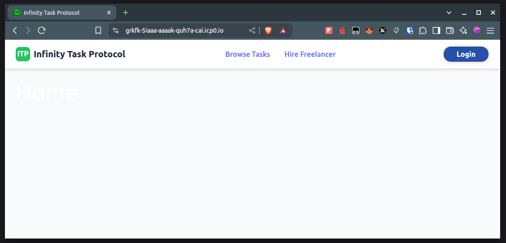
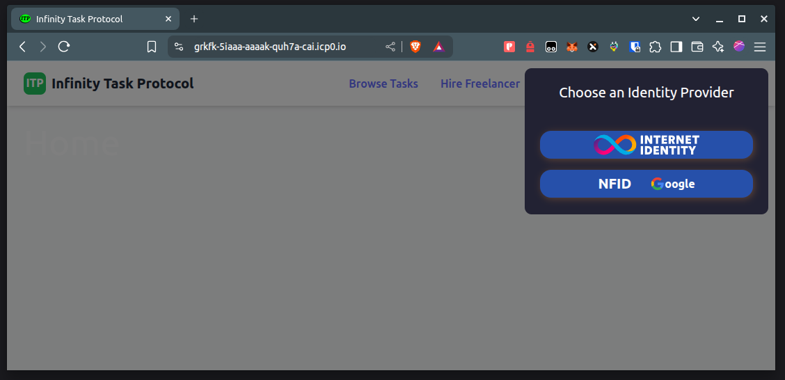
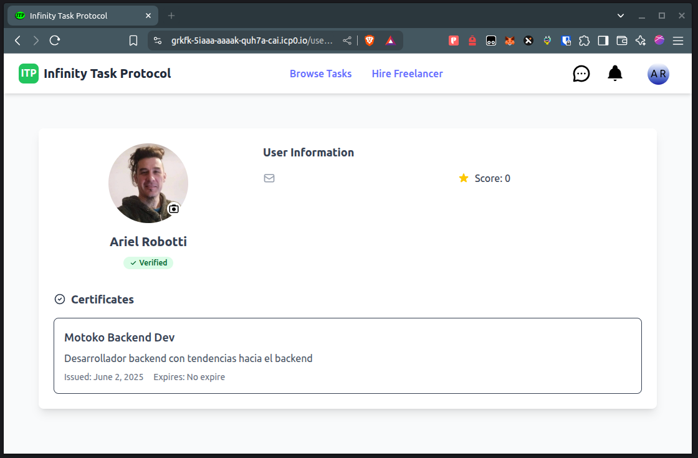
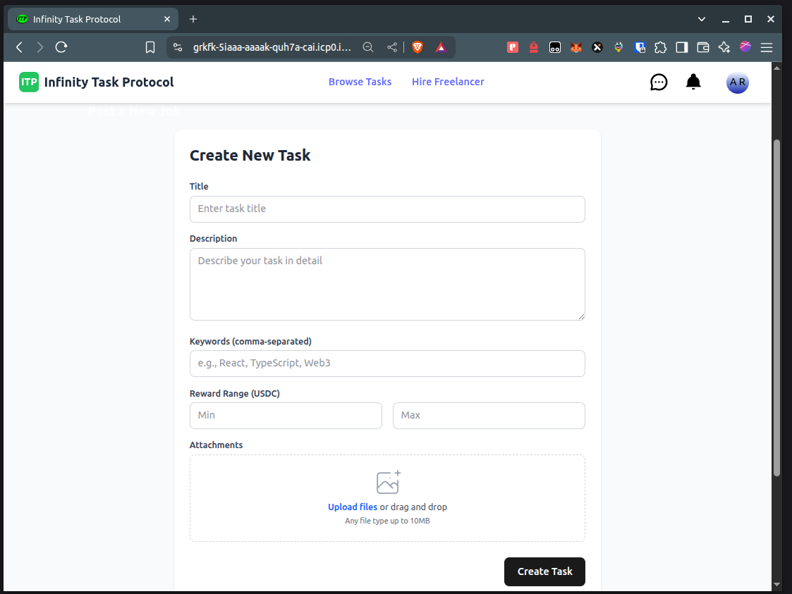
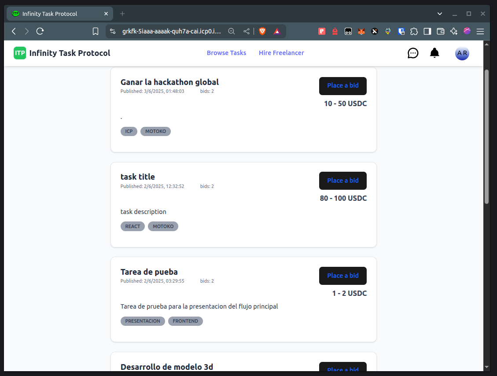
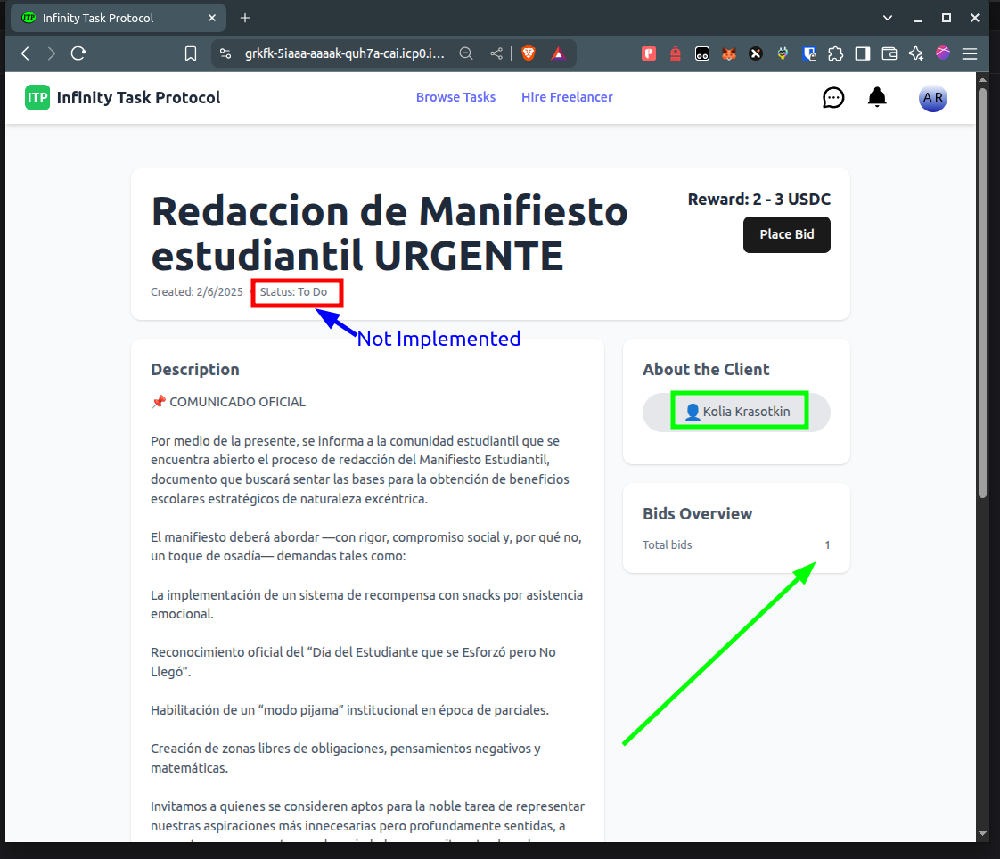
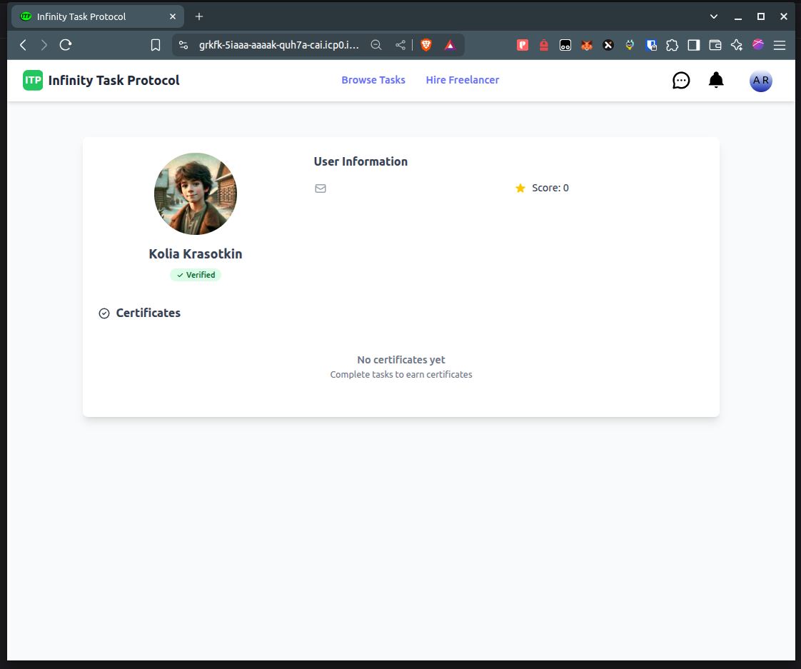
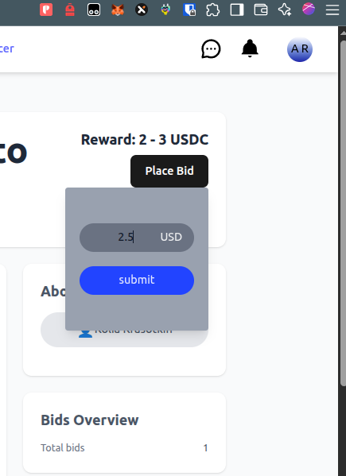
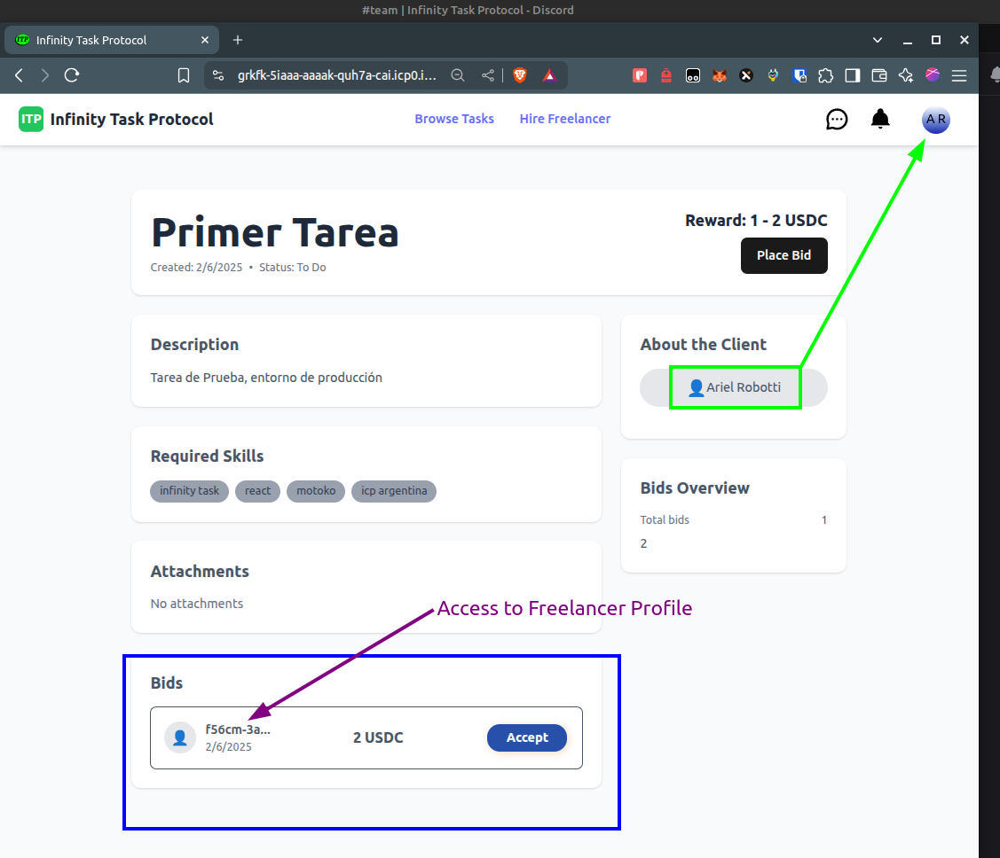
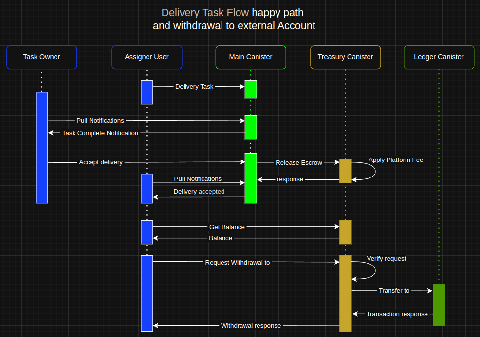

# ♾ Infinity Task Protocol — Fully On-Chain Freelance Service Platform on ICP

**Infinity Task Protocol** is a fully on-chain platform built on the Internet Computer (ICP), designed to facilitate freelance service exchange between clients and workers with ultra-low fees, instant payouts, and full transparency.

---

#### [Deploy instructions](DeployInstructions.md#L1)

---

## 🚨 The Problem

Traditional freelance platforms like Upwork or Fiverr suffer from:

- **Excessive commission rates**: Total effective fees often range from **20% to 40%** when including both platform charges and payment processing cuts.
- **Holding periods**: Freelancers frequently face **delays before receiving their earnings**.
- **High withdrawal costs**, especially in underbanked regions or when converting currencies.

---

## 💡 Our Solution

**Infinity Task Protocol** offers:

- **Fair commissions between 5% and 12%**, all-in.
- **No holding periods**: freelancers get paid instantly upon approval.
- **Crypto-native payments** via ICP tokens.
- **Fully on-chain logic**, built into smart contracts (canisters) on the Internet Computer.

---

## 🔁 How It Works

1. **Task Publishing:**  
   A client publishes a task, including a **description and a price range**.

2. **Freelancer Offers:**  
   Freelancers can submit offers with their proposed fee **within the specified range**. All offers are linked to the task.

3. **Offer Acceptance:**  
   The client accepts the most convenient offer. The system then generates the parameters to **sign a transaction via Plug Wallet**.

4. **Payment to Canister Subaccount:**  
   The backend prepares the transaction arguments, and the user sends ICP tokens to a **dedicated subaccount owned by the treasury canister**.

5. **Transaction Confirmation:**  
   The frontend sends back the **block index** of the transaction.  
   The backend then **verifies that the block contains the transaction**, using fields like `memo`, receiver, and amount.

6. **Escrow Creation:**  
   Once verified, the backend creates an **internal escrow** in favor of the freelancer.

7. **Work Delivery:**  
   The freelancer submits the task. The client **reviews and approves** the delivery.

8. **Funds Release:**  
   Upon approval, the escrow is **released and credited** to the freelancer’s internal balance.

9. **Withdrawal:**  
   Freelancers can **withdraw their earnings** at any time to:
   - A **self-custody wallet**, or
   - Any **CEX that supports the ICP network**.

---
## Pre-Qualification Round Status
A functional MVP with the following features implemented:

#### [Backend](https://a4gq6-oaaaa-aaaab-qaa4q-cai.raw.icp0.io/?id=gyjow-laaaa-aaaak-quh6q-cai)
+ User registration
+ Task creation and publishing
+ Freelancers can submit offers
+ Task owners can accept offers
+ Task delivery by freelancers

#### [Frontend](https://grkfk-5iaaa-aaaak-quh7a-cai.icp0.io/)

* Integration with Internet Identity and NFID:

* Profile view and avatar upload:

* Form for creating new tasks:

* Browsing available public tasks:

* Expanded view of a task:

* View of the task publisher's profile:

* Submit an Offer. Placing an offer on a task:

* Viewing offers received on owned tasks:

---
## Development During the Qualification Round
#### Backend
##### [Treasury Canister](candidTreasuryLink)
* Development and integration of the Treasury canister
   * Architecture design:
      
      
   * Inter-canister communication: Main ⇄ Treasury ⇄ Ledger
   * Main ➜ Treasury. Creation of escrows upon offer acceptance, linked to assigned tasks. [Call](./src/backend/main.mo#L518) ➜ [Remote Function](./src/treasury/treasury.mo#L200-L221)
   * Treasury ➜ TokenLedger. Transaction verification. [Call](./src/treasury/treasury.mo#L205) 
   * Main Treasury. Escrow release to freelancer upon task delivery approval. [Call](./src/backend/main.mo#L613-L615) ➜ [Remote Function](./src/treasury/treasury.mo#L223-L251)
   * Application of platform fee for completed tasks. [Code](./src/treasury/treasury.mo#L244)
   * Withdrawals from Treasury canister to user-defined external wallets. [Call](./src/treasury/treasury.mo#L269-L276)
   * Full payment integration with any ICRC2 whitelist tokens, settable by administration or incorporated on demand. [Code](./src/treasury/treasury.mo#L107-L142)
      * Approval of token listing requests is contingent upon the token's verifiable presence on both decentralized (DEX) and/or centralized (CEX) exchanges with active and consistent market data (price discovery). This ensures a minimum standard of liquidity, legitimacy, and user protection against fraudulent or illiquid assets.
      * Obtaining a list of possible tokens acceptable for paying for a task [Code](./src/treasury/treasury.mo#L173-L175)
##### User Notifications
* 


---
## 🌐 Live Dapp

> ✅ **[Launch App on ICP Mainnet](https://grkfk-5iaaa-aaaak-quh7a-cai.icp0.io/)**  
> 🔐 **Backend Canister ID: [gyjow-laaaa-aaaak-quh6q-cai](https://a4gq6-oaaaa-aaaab-qaa4q-cai.raw.icp0.io/?id=gyjow-laaaa-aaaak-quh6q-cai)**

---

## 📹 Demo Video

🎥 Code and architecture walkthrough with voiceover:  
**[Watch the demo here](https://your-demo-link.com)**

---

## 📄 Documentation

### 🔧 Local Development

1. Clone the repository:
   ```bash
   git clone https://github.com/youruser/infinity-task-protocol.git
   cd infinity-task-protocol
