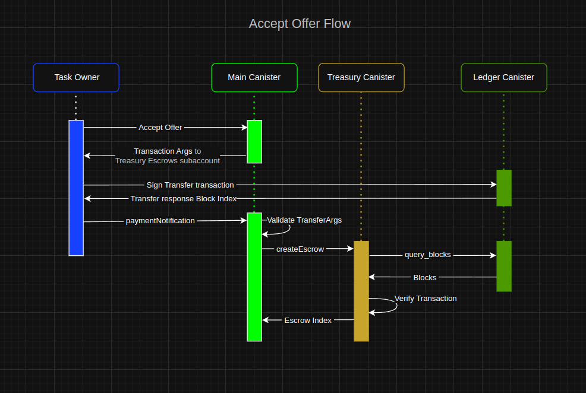

#  Infinity Tasks Protocol
## Fully On-Chain Freelance Service Platform on ICP

**Infinity Task Protocol** is a fully on-chain platform built on the Internet Computer (ICP), designed to facilitate freelance service exchange between clients and workers with ultra-low fees, instant payouts, and full transparency.

---
##### [Whitepaper](Whitepaper.md#L1)
---
This project is licensed under the MIT License – see the [LICENSE](./LICENSE) file for details.

---
##### [Deploy instructions](DeployInstructions.md#L1)

---

## 🚨 The Problem

Traditional freelance platforms like Upwork or Fiverr suffer from:

- **Excessive commission rates**: Total effective fees often range from **20% to 40%** when including both platform charges and payment processing cuts.
- **Holding periods**: Freelancers frequently face **delays before receiving their earnings**.
- **High withdrawal costs**, especially in underbanked regions or when converting currencies.

---

## 💡 Our Solution

**Infinity Task Protocol** offers:

- **Fair commissions between 5% and 12%**, all-in.
- **No holding periods**: freelancers get paid instantly upon approval.
- **Crypto-native payments** via ICP tokens.
- **Fully on-chain logic**, built into smart contracts (canisters) on the Internet Computer.

---

## 🔁 How It Works

1. **Task Publishing:**  
   A client publishes a task, including a **description and a price range**.

2. **Freelancer Offers:**  
   Freelancers can submit offers with their proposed fee **within the specified range**. All offers are linked to the task.

3. **Offer Acceptance:**  
   The client accepts the most convenient offer. The system then generates the parameters to **sign a transaction via Plug Wallet**.

4. **Payment to Canister Subaccount:**  
   The backend prepares the transaction arguments, and the user sends ICP tokens to a **dedicated subaccount owned by the treasury canister**.

5. **Transaction Confirmation:**  
   The frontend sends back the **block index** of the transaction.  
   The backend then **verifies that the block contains the transaction**, using fields like `memo`, receiver, and amount.

6. **Escrow Creation:**  
   Once verified, the backend creates an **internal escrow** in favor of the freelancer.

7. **Work Delivery:**  
   The freelancer submits the task. The client **reviews and approves** the delivery.

8. **Funds Release:**  
   Upon approval, the escrow is **released and credited** to the freelancer’s internal balance.

9. **Withdrawal:**  
   Freelancers can **withdraw their earnings** at any time to:
   - A **self-custody wallet**, or
   - Any **CEX that supports the ICP network**.

---
## Pre-Qualification Round Status
A functional MVP with the following features implemented:

#### [Backend](https://a4gq6-oaaaa-aaaab-qaa4q-cai.raw.icp0.io/?id=gyjow-laaaa-aaaak-quh6q-cai)
+ User registration
+ Task creation and publishing
+ Freelancers can submit offers
+ Task owners can accept offers
+ Task delivery by freelancers

#### [Frontend](https://grkfk-5iaaa-aaaak-quh7a-cai.icp0.io/)

* Integration with Internet Identity and NFID:

* Profile view and avatar upload:

* Form for creating new tasks:

* Browsing available public tasks:

* Expanded view of a task:

* View of the task publisher's profile:

* Submit an Offer. Placing an offer on a task:

* Viewing offers received on owned tasks:

---
## Development During the Qualification Round
#### Backend
##### [Treasury Canister](https://a4gq6-oaaaa-aaaab-qaa4q-cai.raw.icp0.io/?id=irhil-eyaaa-aaaak-qukta-cai)
* Development and integration of the Treasury canister
   * Architecture design:
      
      
   * Inter-canister communication: Main ⇄ Treasury ⇄ Ledger
   * Main ➜ Treasury. Creation of escrows upon offer acceptance, linked to assigned tasks. [Call](./src/backend/main.mo#L518) ➜ [Remote Function](./src/treasury/treasury.mo#L200-L221)
   * Treasury ➜ TokenLedger. Transaction verification. [Call](./src/treasury/treasury.mo#L205) 
   * Main Treasury. Escrow release to freelancer upon task delivery approval. [Call](./src/backend/main.mo#L613-L615) ➜ [Remote Function](./src/treasury/treasury.mo#L223-L251)
   * Application of platform fee for completed tasks. [Code](./src/treasury/treasury.mo#L244)
   * Withdrawals from Treasury canister to user-defined external wallets. [Call](./src/treasury/treasury.mo#L269-L276)
   * Full payment integration with any ICRC2 whitelist tokens, settable by administration or incorporated on demand. [Code](./src/treasury/treasury.mo#L107-L142)
      * Approval of token listing requests is contingent upon the token's verifiable presence on both decentralized (DEX) and/or centralized (CEX) exchanges with active and consistent market data (price discovery). This ensures a minimum standard of liquidity, legitimacy, and user protection against fraudulent or illiquid assets.
      * Obtaining a list of possible tokens acceptable for paying for a task [Code](./src/treasury/treasury.mo#L173-L175)

##### Viewing user balances for the different tokens used on the platform
This consists of a call from the frontend to the Treasury canister to bring the internal balances that the user has internally on the platform.

##### User Notifications

"Push notifications" for users regarding events such as:
+ New offer to complete a task. ➜ Task Owner
+ Offer accepted. ➜ Freelancer who placed the offer.
+ Task submission completed. ➜ Task Owner
+ Submission accepted and balance update. ➜ Freelancer
+ Generic or platform notifications ➜ Users.

---
## Development During the National Round
### Backend
+ #### [Chat Canister](https://a4gq6-oaaaa-aaaab-qaa4q-cai.raw.icp0.io/?id=cxypw-rqaaa-aaaak-quliq-cai)
   + #### [Walkthrough code Video](https://www.youtube.com/watch?v=HvG3danAk9w)

   * **Description**:
      - This module consists of a canister responsible for managing communications between users. 
      - Every **new user** registered on the main platform is **automatically added** to the Chat canister through an **inter-canister call**, enabling them to initiate chat instances with other registered users.
      - Conversations can involve two or more users, and there’s even the possibility for a user to chat with themselves :D. 
      - All communications between the same group of users within the same context are linked to a single Chat, whose identifier is derived from the participants’ Principal IDs (regardless of order) along with a **context parameter**.
      - This context parameter allows multiple **separate Chats** between the same pair of users, distinguishing conversations by their purpose, for example, separating discussions related to different tasks from direct conversations.
      - Additionally, every time someone sends a message, a **notification** is stored for the recipient users. When a user logs in, the frontend retrieves all their pending notifications. Each notification includes the corresponding Chat ID and the name of the message sender, allowing the user to click on a specific notification to be taken directly to the referenced chat.
      - In a subsequent stage, we plan to implement **end-to-end encryption** for all user conversations using **VetKeys**, a decentralized key management system. While messages are already private to the users involved, this will add an **extra layer of privacy** by ensuring that only the sender and intended recipients can access the content of their messages, significantly enhancing the **security** of the platform.
   * [**Architecture design:**](./diagrams/chat_architecture.drawio)
      

#### Main Backend Canister updates:
* **Notification Management**
   * We've implemented a new notification management system that allows users to interact with alerts more efficiently. Key features include:

   * Notification Pulling: Users can pull all pending notifications associated with their account.

   * Mark as Read: A notification can be marked as read, helping users manage their inbox. Each notification is uniquely identified by its timestamp, ensuring the correct alert is updated.

   * Delete Notification: Users also have the option to delete specific notifications. Like the "mark as read" function, this action is performed by identifying the notification by its timestamp.
* **Payment Method Refactoring**
   The payment method has been refactored to offer greater flexibility and support a variety of currencies. The structure of the payment field has changed to accommodate this new functionality, allowing users to make transactions with different tokens rather than a single type of currency.
   * Before: The amount field accepted a simple numeric value (Nat).
   * Now: The new data type for the amount field is a record that includes two fields: token (an identifier for the currency type) and amount (the numeric value). This is represented as {token Token; amount: Nat}.
   * This update is crucial for future developments that seek to integrate diverse currency options, as the logic for adding new supported tokens is already integrated at the backend level within the treasury canister.
* **Communication with the Chat Canister**
   New functionalities have been added to the communication between the main canister and the chat canister, optimizing user management for the messaging system.
   * Automated Registration for New Users: Whenever a new user registers on the main platform, an inter canister call automatically adds them to the chat canister. This ensures the user can start conversations with other members instantly.
   * User Data Synchronization: The main canister now has the ability to synchronize user data with the chat canister. This ensures that key information, such as a user's name or profile picture, remains up to date and consistent across all conversations.

#### Frontend Canister updates:
* **Payment Flow for Accepted Offers**

We've integrated a new payment flow that allows a Task Owner to accept a freelancer's offer and securely process the payment. The new process involves the following steps:
   * Wallet Connection: The user is prompted to connect their Plug wallet to the platform.
   
   * Transaction Signature Request: A transaction is generated with the data provided by the backend, and the user is asked to sign it via their Plug wallet. This signature authorizes the payment.
   
   * Transaction Confirmation: Upon a successful signature, the frontend receives the transaction's block index, which serves as a confirmation of the on-chain event.
   * Ledger Verification: The system verifies the transaction on the corresponding token's ledger to confirm that the payment has been successfully recorded.
   * Escrow Creation: Once the payment is verified, the existing backend and treasury logic is triggered to generate an escrow in favor of the freelancer. This ensures the funds are held securely until the task is completed.
* **User Profile**
   * Profile Management: Users can update their profile information, including uploading and displaying both their profile picture and cover image.
   
   
   * Accurate Pricing Display: Ensures correct visualization of task and offer prices across the platform.
   
   * Notification Bell: A notification bell indicates when new notifications are available.
   
   * Smart Token Selector: In the task creation form, users can select a token from a list fetched directly from the Treasury canister.  
     This list includes all necessary metadata to prevent conversion or calculation errors, particularly those caused by differences in decimal places among tokens.
   
   

#### Treasury Canister updates:
* **Support for anothers tokens icrc2**
**[Video Test: Adding Supported Token to Treasury Canister](https://www.youtube.com/watch?v=aDIGZFAkoqA&t=7s)**

#### Backend (Main Canister)
* **Connection for synchronizing user information with the Chat Canister**
---
#### ︵‿︵‿︵‿︵ [**Roadmap**](./roadmap.md)

---

## 🌐 Live Dapp

> ✅ **[Launch App on ICP Mainnet](https://grkfk-5iaaa-aaaak-quh7a-cai.icp0.io/)**  
> 🔐 **Backend Canister ID: [gyjow-laaaa-aaaak-quh6q-cai](https://a4gq6-oaaaa-aaaab-qaa4q-cai.raw.icp0.io/?id=gyjow-laaaa-aaaak-quh6q-cai)**

---

## 📹 Demo Video

🎥 Code and architecture walkthrough with voiceover:  
**[Watch the demo here](https://www.youtube.com/@InfinityTaskProtocol)**

---

## 📄 Documentation

